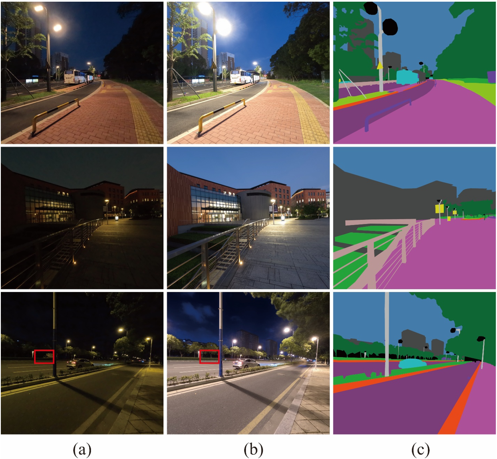
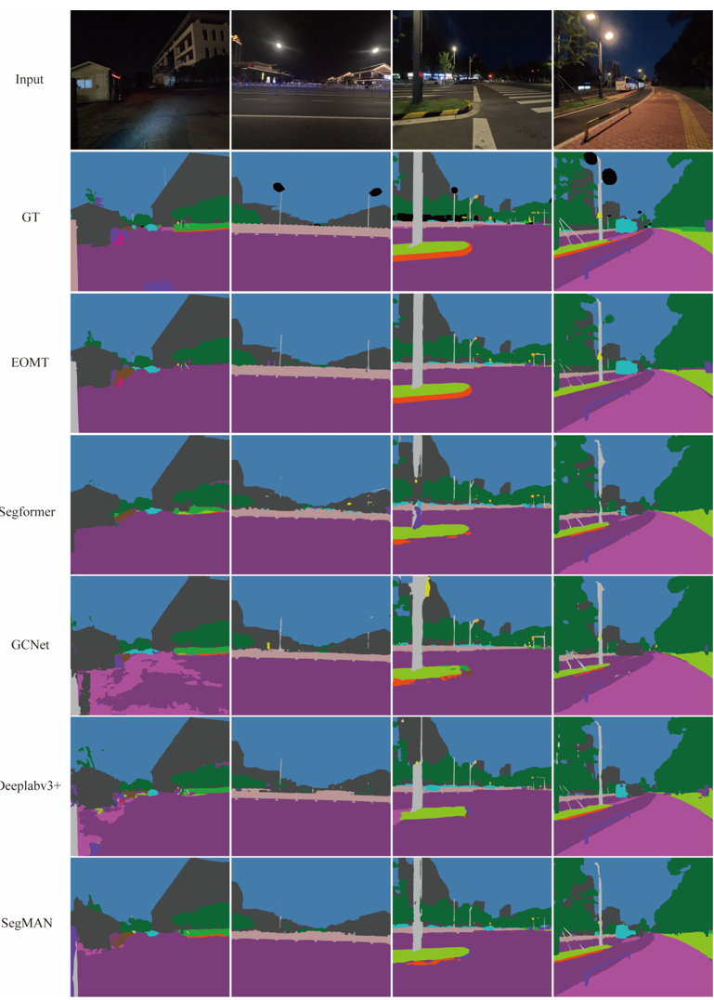

<div align="center">

# NightHiRes

### NightHiRes: an exposure-paired high-resolution dataset for low-light scene semantic segmentation  
A high-resolution nighttime semantic segmentation dataset with normal/long-exposure image pairs.
</div>

---

## Contents

- [Overview](#overview)
- [Dataset](#dataset)
- [Dataset Statistics](#dataset-statistics)
- [Semantic Classes](#semantic-classes)
- [Benchmark](#benchmark)
- [Qualitative Results](#qualitative-results)
- [Download](#download)
- [License](#license)
- [Contact](#contact)
- [Citation](#citation)

---

## Overview

NightHiRes is a high-resolution real-world nighttime semantic-segmentation dataset with dense pixel-level annotations and paired normal- and long-exposure images acquired from the same scenes and viewpoints. 

By providing paired images of the same scene under different exposure
conditions, NightHiRes enables the investigation of how exposure
affects scene visibility and downstream semantic segmentation.


<p align="center">
  
</p>

<p align="center">
  Overview of the NightHiRes dataset.
</p>

---

## Dataset

Semantic segmentation has advanced substantially under well-illuminated daytime conditions, yet reliable segmentation of nighttime scenes remains challenging. existing nighttime semantic-segmentation benchmarks are not specifically designed to isolate how physical exposure conditions affect dense scene understanding. To address this gap, we introduce NightHiRes. The long-exposure images it contains can provide additional light information and can reveal object boundaries and structural details that are difficult to observe in normal-exposure nighttime images.

### Key Features

- High-resolution nighttime images
- One-to-one paired normal- and long-exposure images
- Dense pixel-level semantic annotations
- 19 semantic classes
- Designed for nighttime semantic segmentation research

---

## Dataset Statistics

| Attribute | Description |
|:---|:---|
| Resolution | 5568×4872 |
| Collection equipmentn | GoPro HERO12 |
| Exposure time | 1/125s (normal exposure)<br>2s (long exposure) |
| Dataset size | 350 normal/long-exposure image pairs,<br>including 223 pairs with pixel-level<br>semantic annotations |

**Official split**
| Split | Images |
|:---:|---:|
| Train | 156 |
| Validation | 33 |
| Test | 34 |
| **Total** | **223** |

---

## Semantic Classes

NightHiRes uses 19-class semantic segmentation setting.
Classes marked as void are ignored during training and evaluation.

| **ID** | 0 | 1 | 2 | 3 | 4 | 5 | 6 | 7 | 8 | 9 |
|:---|:---|:---|:---|:---|:---|:---|:---|:---|:---|:---|
| **Class** | Road | Sidewalk | Building | Wall | Fence | Pole | Traffic light | Traffic sign | Traffic cone | Tree |
| **ID** | 10 | 11 | 12 | 13 | 14 | 15 | 16 | 17 | 18 | 19 |
| **Class** | Shrub | Grass | Sky | People | Rider | Car | Curbs | Small-scale vehicle | Clutter | Void |

---

## Benchmark

NightHiRes can be used to evaluate semantic segmentation models under
different exposure conditions.

### Benchmark Results

Segmentation results of normal-exposure images

| Method | road | sidew. | build. | wall | fence | pole | light | sign | cone | tree | shrub | grass | sky | people | rider | car | curbs | clutter | small. | mIoU |
|:---|---:|---:|---:|---:|---:|---:|---:|---:|---:|---:|---:|---:|---:|---:|---:|---:|---:|---:|---:|---:|
| EOMT (Kerssies et al., 2025) | 75.32 | 64.96 | 84.77 | 38.37 | 63.86 | 64.81 | 53.10 | 73.02 | 45.09 | 83.53 | 38.94 | 66.05 | 91.34 | 51.90 | 51.76 | 88.35 | 29.88 | 35.02 | 77.91 | **62.00** |
| SegFormer (Xie et al., 2021) | 66.24 | 47.59 | 74.02 | 59.34 | 53.07 | 46.13 | 43.60 | 35.51 | 3.16 | 77.20 | 26.25 | 60.42 | 89.63 | 0.00 | 13.86 | 63.39 | 17.61 | 9.81 | 59.47 | 44.54 |
| GCNet (Yang et al., 2025) | 69.33 | 51.89 | 71.05 | 25.76 | 44.37 | 49.36 | 43.53 | 49.06 | 6.25 | 76.09 | 26.18 | 57.11 | 84.73 | 0.00 | 39.30 | 59.23 | 19.27 | 9.02 | 48.17 | 43.67 |
| DeepLabV3+ (L.-C. Chen et al., 2018) | 67.65 | 45.13 | 70.61 | 70.69 | 44.02 | 51.10 | 44.15 | 54.21 | 15.57 | 75.76 | 29.52 | 56.41 | 85.05 | 0.00 | 0.15 | 59.15 | 11.03 | 15.41 | 63.62 | 45.22 |
| SegMAN (Fu et al., 2025) | 68.11 | 48.99 | 74.45 | 43.01 | 52.68 | 52.12 | 46.52 | 38.36 | 7.23 | 76.39 | 27.11 | 58.29 | 85.64 | 0.00 | 44.32 | 75.16 | 11.72 | 12.30 | 59.31 | 46.41 |

Segmentation results of long-exposure images

| Method | road | sidew. | build. | wall | fence | pole | light | sign | cone | tree | shrub | grass | sky | people | rider | car | curbs | clutter | small. | mIoU |
|:---|---:|---:|---:|---:|---:|---:|---:|---:|---:|---:|---:|---:|---:|---:|---:|---:|---:|---:|---:|---:|
| EOMT (Kerssies et al., 2025) | 78.26 | 70.77 | 90.19 | 54.71 | 69.97 | 72.39 | 71.24 | 79.41 | 46.64 | 90.30 | 49.04 | 71.48 | 95.40 | 59.91 | 30.49 | 92.03 | 24.00 | 48.41 | 85.91 | **67.40** |
| SegFormer (Xie et al., 2021) | 68.11 | 51.84 | 85.30 | 42.25 | 51.08 | 54.93 | 46.33 | 54.03 | 11.33 | 88.12 | 39.65 | 69.03 | 95.23 | 0.77 | 10.13 | 79.70 | 17.01 | 18.64 | 74.03 | 50.39 |
| GCNet (Yang et al., 2025) | 72.44 | 64.38 | 84.19 | 32.05 | 50.27 | 54.92 | 44.63 | 54.13 | 16.35 | 87.68 | 32.16 | 73.61 | 92.89 | 28.64 | 39.12 | 79.26 | 32.60 | 26.05 | 65.04 | 54.23 |
| DeepLabV3+ (L.-C. Chen et al., 2018) | 76.77 | 68.35 | 86.96 | 56.88 | 59.40 | 64.93 | 51.88 | 68.91 | 22.06 | 89.10 | 35.13 | 69.66 | 94.66 | 0.00 | 36.74 | 83.00 | 22.61 | 24.39 | 77.09 | 57.29 |
| SegMAN (Fu et al., 2025) | 77.38 | 69.75 | 88.29 | 47.20 | 56.45 | 61.97 | 52.35 | 39.70 | 9.73 | 89.94 | 32.45 | 69.14 | 95.47 | 16.67 | 8.83 | 87.85 | 24.82 | 23.34 | 76.32 | 54.09 |

---

## Qualitative Results

<p align="center">
  
</p>

<p align="center">
  Qualitative semantic segmentation results on the NightHiRes normal-exposure test set.
</p>

---

## Download

The NightHiRes dataset will be released soon.

**Dataset:** Coming soon.

**Code:** Coming soon.

---
## License
The license information will be provided with the official dataset release.

---

## Contact
If you have any questions or suggestions, please contact Lei.Fan@xjtlu.edu.cn.

---

## Citation

If you find NightHiRes useful for your research, please consider
citing our work:

```bibtex
@article{night hires,
  title={NightHiRes: A High-Resolution Paired Dataset for Nighttime Semantic Segmentation},
  author={TBD},
  journal={TBD},
  year={TBD}
}
